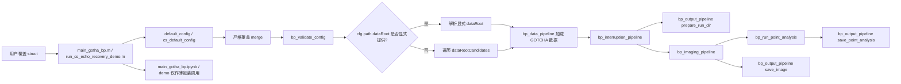

# Phase 1: 实验基线与配置契约 - Research

**Researched:** 2026-04-18
**Domain:** MATLAB brownfield 科研工程的可复现实验基线整理与配置契约收紧
**Confidence:** HIGH

<user_constraints>
## User Constraints (from CONTEXT.md)

### Locked Decisions
- 用户配置覆盖采用严格失败策略。任何未知字段、错拼字段或错误层级都必须立即报错并停止运行。
- 配置错误信息必须同时包含错误位置和错误原因，不能只给模糊的 “invalid config” 类提示。
- 数据集定位采用“显式路径优先，约定查找兜底”的规则。
- 当配置中明确提供数据根目录时，运行流程直接使用该目录；只有没有显式路径时，才回退到当前候选目录查找逻辑。
- 正式主流程默认采用 headless 模式，不默认弹出图窗或依赖交互界面。
- notebook 和 demo 入口可以保持交互体验，用于探索、演示或手工查看结果，但不应定义正式实验默认值。
- `main_gotha_bp.m` 是唯一真实入口，正式逻辑只保留在 `.m` 文件中。
- `main_gotha_bp.ipynb`、demo 或辅助脚本只能调用 `main_gotha_bp.m`，不能再复制主实现逻辑。
- `img/`、`results/` 以及大多数 `.mat` / `.jpg` / `.txt` 实验输出默认不纳入版本控制。
- 仓库主要保留代码、文档、配置和极少量必要样例；可复现实验依赖明确的运行约定和元数据，而不是整批提交运行结果。

### the agent's Discretion
- 配置错误的内部实现方式可由后续 planner 决定，例如是在 `bp_merge_config.m` 阶段拦截未知字段，还是引入单独的 schema/allowlist 校验层。
- headless 默认值的具体字段落点可由后续 planner 决定，但必须保证正式主流程默认不依赖 GUI。
- notebook 变成薄包装的具体形式可由后续 planner 决定，例如单 cell 调用、参数示例 cell、或最小实验演示模板。
- 结果产物忽略策略的具体规则可由后续 planner 决定，但必须覆盖 `img/` 与 `cs_echo_recovery/results/`。

### Deferred Ideas (OUT OF SCOPE)
- None - discussion stayed within phase scope
</user_constraints>

<architectural_responsibility_map>
## Architectural Responsibility Map

本项目是单机本地 MATLAB 应用，不存在前后端/数据库分层；但 Phase 1 仍需按职责边界收口，避免“入口、配置、数据路径、输出规则”继续缠在一起。

| Capability | Primary Tier | Secondary Tier | Rationale |
|------------|-------------|----------------|-----------|
| 用户覆盖配置的字段白名单与失败语义 | 配置契约层（`config/default_config.m` + `src/bp_merge_config.m` + `src/bp_validate_config.m`） | 入口编排层（`main_gotha_bp.m`、`run_cs_echo_recovery_demo.m`） | 允许什么字段、未知字段怎么报错，必须由共享配置层统一决定，入口只负责调用 |
| 数据根目录解析 | 数据加载层（`src/bp_data_pipeline.m`） | 默认配置层（`config/default_config.m`） | “显式路径优先、候选路径兜底”是数据获取规则，不能散落到 README 或入口脚本里 |
| 正式运行默认值（headless） | 默认配置层（`config/default_config.m`） | 输出层（`src/bp_output_pipeline.m`） | 正式默认值必须来自默认配置；输出层要支持在 headless 下仍能保存需要的产物 |
| 真实主入口 | 入口编排层（`main_gotha_bp.m`） | notebook/demo 薄包装 | 正式实现只能保留一份，wrapper 只负责调用和展示 |
| 运行产物约定与忽略策略 | 输出层（`src/bp_output_pipeline.m`、`cs_echo_recovery/cs_recovery_pipeline.m`） | 仓库治理层（`.gitignore`、README） | 产物生成由代码决定，是否纳入版本控制由仓库规则和文档共同钉牢 |
</architectural_responsibility_map>

<research_summary>
## Summary

Phase 1 不需要引入新的外部技术栈，关键在于把现有 brownfield MATLAB 工程收紧成一个“可控、可报错、可说明、可复用”的实验基线。代码现状已经具备良好切入点：`main_gotha_bp.m` 是清晰的主编排入口，`bp_data_pipeline.m` 统一了数据加载，`bp_output_pipeline.m` 已经统一了输出目录与产物写入，`cs_recovery_pipeline.m` 也已经复用主流程的配置和数据管线。问题不在于“缺少架构”，而在于若干关键契约仍然过松。

最主要的技术缺口有四个。第一，`bp_merge_config.m` 当前允许未知字段静默混入配置树，这直接破坏科研实验的可信度。第二，数据集定位仍然只有约定式查找，没有显式 `dataRoot` 入口。第三，主流程默认值仍偏向交互式显示，而非正式批处理。第四，`main_gotha_bp.ipynb` 仍持有重复实现，运行产物也尚未通过仓库忽略规则明确收口。

**Primary recommendation:** 以“默认配置结构即 schema”的思路收紧 Phase 1：共享严格 merge + 显式 `dataRoot` + 主流程 headless 默认 + notebook 薄包装 + 运行产物默认忽略，并把这些规则同步到 README 和最小示例中。
</research_summary>

<standard_stack>
## Standard Stack

这里的“标准栈”不是新增库，而是本仓库现有、应继续复用的实现骨架。

### Core
| Component | Current Location | Purpose | Why Standard For This Repo |
|-----------|------------------|---------|-----------------------------|
| 默认配置工厂 | `config/default_config.m` | 定义主流程全部默认值 | 已是主流程配置单一来源，适合作为字段白名单基准 |
| 递归覆盖入口 | `src/bp_merge_config.m` | 合并用户覆盖与默认配置 | 已被主流程和恢复流程复用，适合升级为严格 merge |
| 类型/范围校验 | `src/bp_validate_config.m` | 在昂贵计算前 fail fast | 已经承担正式校验职责，适合保留为统一错误出口 |
| 数据定位与加载 | `src/bp_data_pipeline.m` | 解析数据路径并加载 GOTCHA `.mat` | 已经集中持有路径上下文与候选目录查找逻辑 |
| 正式主入口 | `main_gotha_bp.m` | 编排标准 BP 流程 | 已经是最清晰的 source of truth，不应再复制 |

### Supporting
| Component | Current Location | Purpose | When to Use |
|-----------|------------------|---------|-------------|
| 恢复实验默认配置 | `cs_echo_recovery/cs_default_config.m` | 恢复链路默认值与主流程覆盖 | 恢复入口需要主流程不同默认值时使用，但不应再补锅主流程错误默认值 |
| 恢复实验入口 | `cs_echo_recovery/run_cs_echo_recovery_demo.m` | 压缩感知实验入口 | 需要统一到共享 merge/validate 语义时使用 |
| 统一输出模块 | `src/bp_output_pipeline.m` | runDir、图像和分析产物保存 | Phase 1 中处理 headless 与保存逻辑解耦的最佳落点 |
| 仓库说明 | `README.md` | 用户理解数据放置、运行命令和输出约定 | 满足 REP-01 的主文档 |

### Alternatives Considered
| Instead of | Could Use | Tradeoff |
|------------|-----------|----------|
| 以默认配置 struct 作为 schema | 单独再造一份 schema 文件或类 | 额外增加一份需要同步维护的真值来源，brownfield 成本高 |
| 升级 `bp_merge_config.m` 为严格 merge | 保持宽松 merge，再依赖 `bp_validate_config.m` 兜底 | 无法拦截未知字段和错层级，仍会产生静默误配置 |
| 单一 `.m` 入口 + wrapper notebook | 保持 `.m` / `ipynb` 双实现并行 | 修一次 bug 要改两处，行为极易漂移 |
</standard_stack>

<architecture_patterns>
## Architecture Patterns

### System Architecture Diagram



### Recommended Project Structure
```text
project-root/
├── config/
│   └── default_config.m              # 正式主流程默认值与字段 schema
├── src/
│   ├── bp_merge_config.m             # 严格递归覆盖
│   ├── bp_validate_config.m          # 类型/范围校验
│   ├── bp_data_pipeline.m            # 显式 dataRoot + 候选路径兜底
│   └── bp_output_pipeline.m          # headless 下的产物保存
├── cs_echo_recovery/
│   ├── cs_default_config.m           # 恢复实验默认值
│   └── run_cs_echo_recovery_demo.m   # 恢复实验入口
├── examples/                         # 最小运行示例（Phase 1 后新增）
├── docs/                             # 契约/约定文档（Phase 1 后新增）
├── main_gotha_bp.m                   # 唯一真实入口
├── main_gotha_bp.ipynb               # 交互 wrapper
└── README.md                         # 面向研究者的总入口说明
```

### Pattern 1: Schema-First Strict Merge
**What:** 以默认配置 struct 为唯一 schema，用户覆盖只能修改已存在字段；未知字段、错拼字段、错误层级立即失败。
**When to use:** 所有入口的用户配置覆盖，包括 `main_gotha_bp(userConfig)`、`run_cs_echo_recovery_demo(userConfig)` 和 `csCfg.project` 的主流程配置桥接。
**Example:**
```matlab
cfg = default_config();
cfg = bp_merge_config(cfg, userConfig);   % 只允许覆盖已定义字段
cfg = bp_validate_config(cfg);            % 再做类型/范围校验
```

### Pattern 2: Explicit Path First, Convention Fallback
**What:** 新增显式 `cfg.path.dataRoot`；为空时才使用 `cfg.path.dataRootCandidates`。
**When to use:** 所有正式实验和可复现实验脚本。
**Example:**
```matlab
cfg = default_config();
cfg.path.dataRoot = 'E:\dataset\gotcha_BP';
result = main_gotha_bp(cfg);
```

### Pattern 3: Single Real Entrypoint, Thin Interactive Wrapper
**What:** `main_gotha_bp.m` 保存唯一主流程实现；notebook 只做 `addpath + 构造 userCfg + 调用函数`。
**When to use:** 所有 notebook/demo/启动脚本。
**Example:**
```matlab
projectRoot = fileparts(pwd);
addpath(projectRoot);
result = main_gotha_bp(userCfg);
```

### Pattern 4: Output Policy Independent from Figure Visibility
**What:** 是否保存点目标分析图片由 `config.output.savePointAnalysisImage` 决定，而不是由 `showFigures` 绑死。
**When to use:** headless 批处理和远程跑实验时。
**Example:**
```matlab
cfg.analysis.pointAnaCfg.showFigures = false;
cfg.output.savePointAnalysisImage = true;
```

### Anti-Patterns to Avoid
- **宽松 merge 继续吞未知字段：** 这会让错拼配置看起来“运行成功”，但实际实验条件已失真。
- **在 notebook 中复制主流程函数体：** 会让 `.m` 和 `.ipynb` 逻辑分叉，违背唯一入口决策。
- **只靠候选目录扫描定位数据：** 一旦换机器或换工作区层级就会报错，无法支撑明确复现。
- **把图片导出与 `showFigures` 绑定：** 主流程一旦默认 headless，就会顺带失去应当保留的科研产物。
</architecture_patterns>

<dont_hand_roll>
## Don't Hand-Roll

| Problem | Don't Build | Use Instead | Why |
|---------|-------------|-------------|-----|
| 配置 schema | 新的类系统、JSON schema、第二套元配置文件 | 现有 `default_config.m` 结构树 | brownfield 最小改动，避免双份真值来源 |
| 第二个正式入口 | notebook 内再写一套完整主流程 | `main_gotha_bp.m` + notebook wrapper | 降低漂移风险，后续 Phase 2-5 只维护一处逻辑 |
| 数据启动流程 | 更复杂的自动扫描器或安装器 | 显式 `dataRoot` + 少量候选路径兜底 | 个人科研项目更需要可解释和可控，而不是“猜测式智能” |
| 运行产物管理 | 把整批结果继续纳入 Git | `.gitignore` + README + runDir 元数据 | 源码仓库不应与某次实验结果绑定 |

**Key insight:** Phase 1 的目标不是重写工程，而是收紧现有工程的契约边界。能复用现有 `struct`、现有 pipeline、现有输出模块，就不要新造并行体系。
</dont_hand_roll>

<common_pitfalls>
## Common Pitfalls

### Pitfall 1: 先 merge 再发现拼写错误，但已经丢失错误上下文
**What goes wrong:** 未知字段已经混入配置树，后续只在某个深层模块报出“不支持类型”或“字段不存在”。
**Why it happens:** 当前 `bp_merge_config.m` 对未知字段直接赋值。
**How to avoid:** 在 merge 阶段就用默认配置树做路径级校验，错误文本必须带 dotted path。
**Warning signs:** 用户写了 `showProgess` 这种错拼字段，但程序并未立即失败。

### Pitfall 2: 主流程切成 headless 后，点目标分析图片反而不再导出
**What goes wrong:** 为了批处理关闭 `showFigures`，同时把本应保留的分析图片也关掉了。
**Why it happens:** `bp_output_pipeline.m` 当前把 `savePointAnalysisImage` 和 `showFigures` 绑在一起。
**How to avoid:** 让保存逻辑只受输出开关控制，绘图导出时统一使用不可见 figure。
**Warning signs:** `point_analysis_summary.txt` 生成了，但 `point_analysis_*.jpg` 全部缺失。

### Pitfall 3: notebook 与 `.m` 行为悄悄漂移
**What goes wrong:** 主流程修好了 bug，但 notebook 仍跑旧逻辑。
**Why it happens:** `main_gotha_bp.ipynb` 复制了函数实现。
**How to avoid:** notebook 只保留调用单元，不保留主算法实现。
**Warning signs:** 同一组配置在 `.m` 与 notebook 下输出不一致。

### Pitfall 4: 输出目录规则写在代码里，但仓库忽略规则和 README 没同步
**What goes wrong:** 运行目录一直被生成，但研究者不知道哪些应提交、哪些只是本地产物。
**Why it happens:** 代码产物规则、Git 忽略规则和用户文档分离。
**How to avoid:** `.gitignore`、README、示例脚本一起更新。
**Warning signs:** `git status` 反复出现 `img/` 和 `cs_echo_recovery/results/` 噪声。
</common_pitfalls>

<code_examples>
## Code Examples

### 严格 merge 的期望调用顺序
```matlab
% Source: main_gotha_bp.m + src/bp_merge_config.m + src/bp_validate_config.m
config = default_config();
if nargin >= 1 && ~isempty(userConfig)
    config = bp_merge_config(config, userConfig);
end
config = bp_validate_config(config);
```

### 显式数据路径优先的最小示例
```matlab
% Source target: config/default_config.m + src/bp_data_pipeline.m
userCfg = struct();
userCfg.path = struct('dataRoot', 'E:\dataset\gotcha_BP');
userCfg.display = struct('showProgress', false, 'showInterruptedEcho', false);
result = main_gotha_bp(userCfg);
```

### notebook 作为薄包装而不是第二入口
```matlab
% Source target: main_gotha_bp.ipynb
projectRoot = fileparts(mfilename('fullpath'));
addpath(projectRoot);
userCfg = struct();
result = main_gotha_bp(userCfg);
```
</code_examples>

<sota_updates>
## State of the Art (Current Repo Baseline -> Phase 1 Recommendation)

| Old Approach | Current Approach | When Changed | Impact |
|--------------|------------------|--------------|--------|
| 宽松递归 merge，未知字段直接写入 | 严格 merge，未知字段与错层级立即失败 | Phase 1 | 避免静默误配置 |
| 仅靠 `dataRootCandidates` 约定查找 | 显式 `cfg.path.dataRoot` 优先，候选目录兜底 | Phase 1 | 提高跨机器复现性 |
| 主流程默认偏交互 | 主流程默认 headless，wrapper 保留交互 | Phase 1 | 更适合正式批处理和后续自动化 |
| notebook 持有重复实现 | `.m` 单入口，notebook 只调用 | Phase 1 | 降低入口漂移风险 |

**New patterns to consider:**
- `cfg.path.dataRoot` 作为正式实验首选入口，而不是依赖用户记住工作区层级。
- `.gitignore` + `examples/` + `docs/` 作为实验基线契约的文档化组合。

**Deprecated/outdated in this repo context:**
- 宽松 merge + 深层 assert 才报错。
- notebook 内复制主流程函数体。
</sota_updates>

<open_questions>
## Open Questions

1. **`main_gotha_bp.ipynb` 当前已有用户本地改动，如何收口为薄包装而不误删探索内容？**
   - What we know: 当前工作区里该文件是已修改状态，说明其中可能有用户实验性单元。
   - What's unclear: 哪些 cell 是必须保留的探索记录，哪些是应删除的重复主逻辑。
   - Recommendation: 执行时优先保留非主逻辑说明/探索 cell，只移除或替换重复的主流程实现单元。

2. **`open_vscode_matlab_notebook.cmd` 是否要进入正式可复现路径？**
   - What we know: 当前文件使用了强机器绑定绝对路径，且尚未被版本控制。
   - What's unclear: 用户是否希望把它保留为本地便捷脚本，还是升级成正式文档支持的 launcher。
   - Recommendation: Phase 1 先把它降级为“可选本地辅助工具”，正式入口仍以 MATLAB 函数和 README 为准。
</open_questions>

<sources>
## Sources

### Primary (HIGH confidence)
- `config/default_config.m` - 当前正式主流程默认值和路径候选配置
- `src/bp_merge_config.m` - 当前宽松递归 merge 行为
- `src/bp_validate_config.m` - 当前类型/范围 fail-fast 校验
- `src/bp_data_pipeline.m` - 当前数据根目录定位和加载规则
- `main_gotha_bp.m` - 当前唯一正式 `.m` 主入口
- `cs_echo_recovery/cs_default_config.m` - 恢复实验默认值与主流程覆盖关系
- `cs_echo_recovery/run_cs_echo_recovery_demo.m` - 恢复演示入口当前使用本地 merge helper
- `cs_echo_recovery/cs_recovery_pipeline.m` - 恢复流程如何桥接主流程配置
- `src/bp_output_pipeline.m` - runDir、图像和点目标分析产物保存逻辑
- `README.md` - 当前对数据放置、命令和输出的说明基线
- `open_vscode_matlab_notebook.cmd` - 当前本地 launcher 的机器绑定现状
- `.planning/codebase/ARCHITECTURE.md` - 代码架构与模块职责分析
- `.planning/codebase/CONCERNS.md` - 与本 phase 直接相关的技术债与风险
- `.planning/codebase/STRUCTURE.md` - 当前目录布局和产物位置
- `.planning/codebase/CONVENTIONS.md` - 代码和入口风格约定

### Secondary (MEDIUM confidence)
- `.planning/ROADMAP.md` - Phase 1 目标、成功标准和计划拆分
- `.planning/REQUIREMENTS.md` - Phase 1 的 REQ 映射
- `.planning/phases/01-experiment-baseline-config-contract/01-CONTEXT.md` - 锁定决策来源

### Tertiary (LOW confidence - needs validation)
- None
</sources>

<metadata>
## Metadata

**Research scope:**
- Core technology: 本地 MATLAB 函数式流水线
- Ecosystem: 默认配置、数据加载、输出管理、恢复实验桥接
- Patterns: 严格 merge、显式路径优先、单真实入口、headless 输出解耦
- Pitfalls: 静默误配置、headless 导致图片不导出、入口漂移、产物未收口

**Confidence breakdown:**
- Standard stack: HIGH - 直接来自当前代码与 codebase map
- Architecture: HIGH - 主入口、配置和数据路径落点明确
- Pitfalls: HIGH - 与现有实现一一对应
- Code examples: HIGH - 都来自仓库当前代码结构和 Phase 1 目标

**Research date:** 2026-04-18
**Valid until:** 2026-05-18
</metadata>

---

*Phase: 01-experiment-baseline-config-contract*
*Research completed: 2026-04-18*
*Ready for planning: yes*
